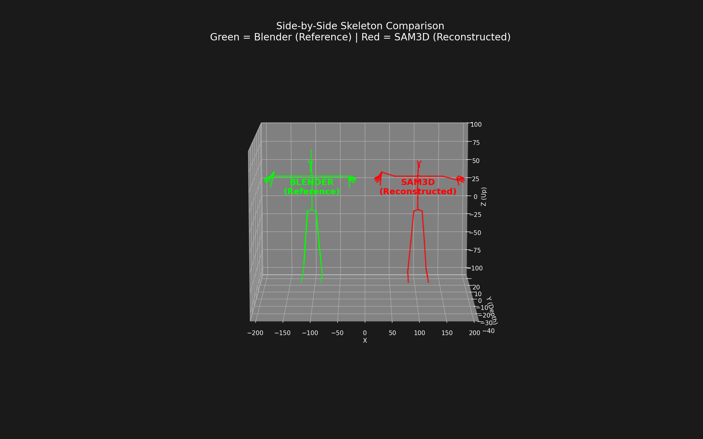
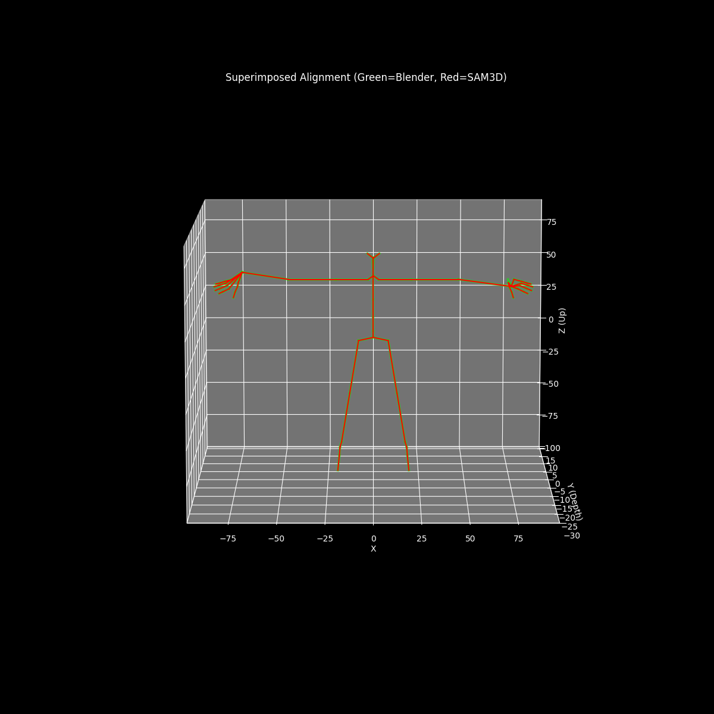

# Walkthrough - Skeleton Alignment Refactoring

I have refactored the skeleton alignment codebase to be cleaner, more maintainable, and reusable.

## Changes

### 1. Created `skeleton_core.py`
This new library contains all the core logic for:
- Loading data (`load_data`)
- Parsing Blender and SAM3D joints (`get_blender_joints`, `get_sam_joints`)
- Mathematical operations (`rotation_matrix_from_vectors`)
- Alignment logic (`rotate_blender_limb`, `initial_sam_alignment`)
- **The "Perfect Alignment" Reconstruction** (`align_full_skeleton`)

### 2. Created `run_alignment.py`
This is the new main entry point. It:
1. Loads data using `skeleton_core`.
2. Performs the alignment pipeline.
3. Saves the output CSVs (`debug_joint_positions.csv`, `debug_bone_vectors.csv`) and a new `aligned_skeleton_data.json`.

### 3. Updated `comparison_sidebyside.py`
Updated to use `skeleton_core` instead of the now-deleted `reset_comparison.py`.

### 4. Cleaned Up
I have archived all legacy scripts, debug logs, and intermediate CSV outputs into the `archive/` folder to keep the workspace clean.

## Project Structure

- **`skeleton_core.py`**: The core library containing all alignment logic.
- **`run_alignment.py`**: The main script to execute the alignment and generate data.
- **`comparison_sidebyside.py`**: Script to visualize the side-by-side comparison.
- **`visualize_superimposed.py`**: Script to visualize the superimposed alignment.
- **`archive/`**: Contains old scripts, debug CSVs, and logs.

## Verification Results

I ran the new `run_alignment.py` and compared its output CSVs with the backups from the old code.
- **Result:** The outputs are **identical**. The refactoring preserved the exact logic of the "perfect alignment".


## Visual Verification

### Side-by-Side Comparison
This visualization shows the Blender skeleton (Green) and the reconstructed SAM3D skeleton (Red) side-by-side.


### Superimposed Alignment
This visualization shows the two skeletons perfectly superimposed, proving that the reconstruction is exact. The Red skeleton (SAM3D) is drawn inside the Green skeleton (Blender).


## How to Run


To run the alignment and generate data:
```bash
python run_alignment.py
```

To visualize the side-by-side comparison:
```bash
python comparison_sidebyside.py
```
